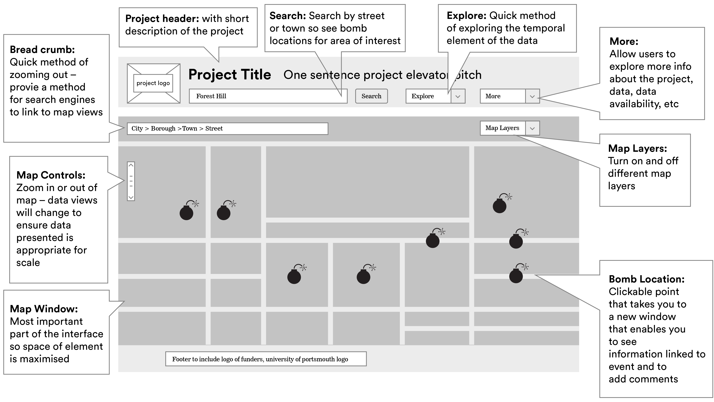
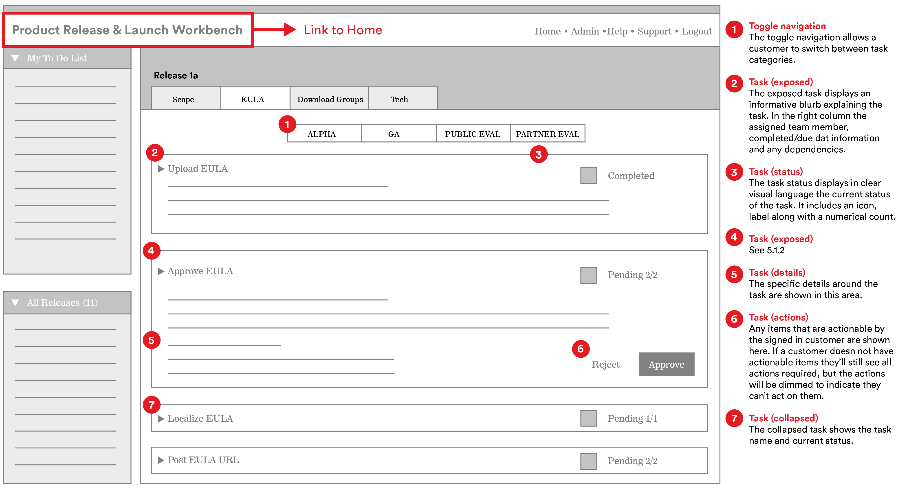
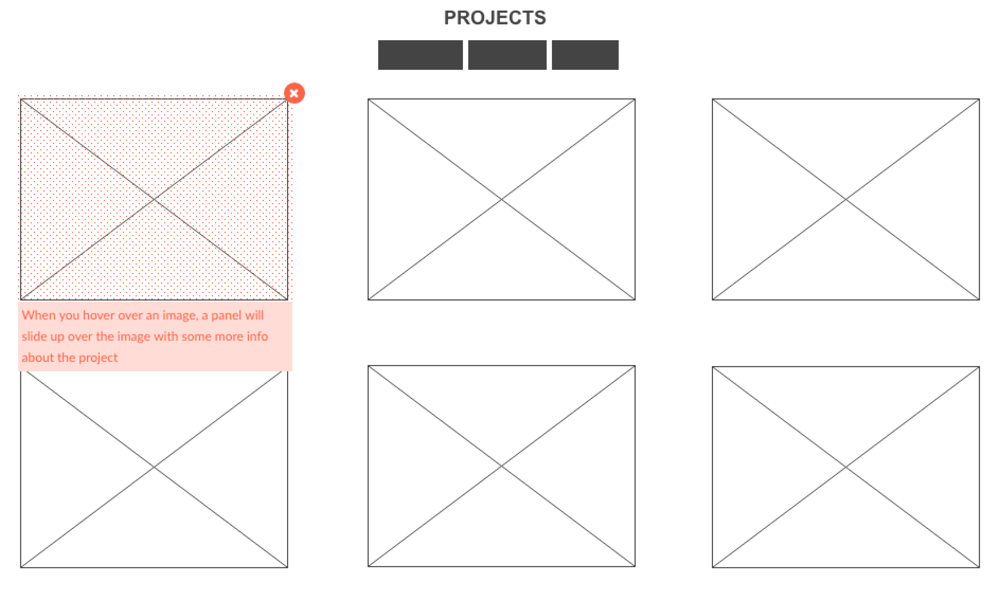
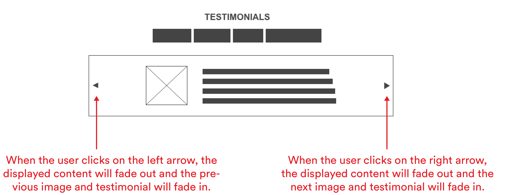
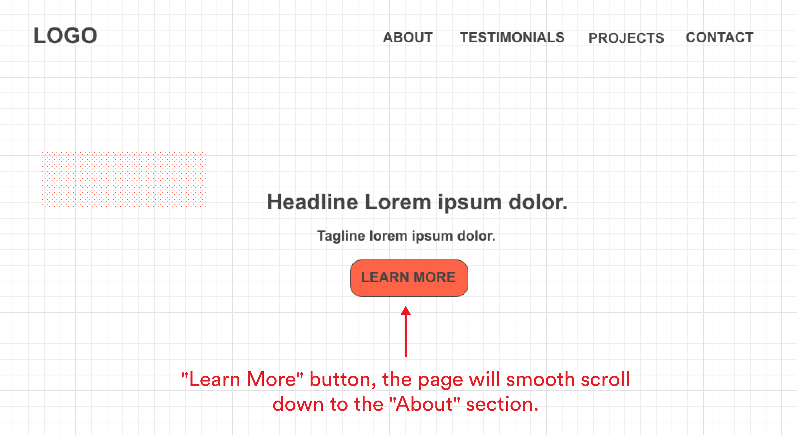

#  Wireframes, Layouts and Grid Systems 

### LEARNING OBJECTIVES
*After this lesson, you will be able to:*
- Describe what a wireframe is and its role in the development process.
- Describe the differences between low/medium/high-fidelity markups.
- Create a wireframe to define the layout and user flow for your app.

---

## Introduction: Wireframes 

Wireframes illustrate how the user interfaces with information. A wireframe answers questions as general as _"How does a user access the About page?"_ and as specific as _"What will change on the screen if the user clicks 'submit'?"_ Most wireframes are free of any color or visual design elements, and simply show boxes and lines with notations to outline user interactions.

Wireframes will look different depending on who creates them, but they should always include details about the functionality.

### Wireframes in the Wild
As a developer, you'll often build pages and sites from wireframes created by User Experience (UX) Designers. Wireframes should detail any and all functionality on the page. If building a website was like building a house, wireframes might be considered the blueprints. They're an important element of communication between the design and engineering teams.

### Want to Create Your Own?

#### Thumbnail Sketches
Wireframing before you build a page or site can be a helpful exercise in planning the functionality and basic layout, especially if your team doesn't have UX Designers. Low-fi wireframes, often called thumbnail sketches, are an easy and quick way to begin. Thumbnail sketches are meant to be drawn quickly, as a way to prototype different layouts for your content. They consist of very simple boxes and lines to represent different elements on the page.

[via sopachu.wordpress.com](https://soapchu.wordpress.com/category/traditional-illustrations/)

#### User Stories
You might also start by creating User Stories. Imagine 3-4 different types of users who will come to your site. Is this a first-time user? A user hesitant to sign up? A user who's been a member of the site for years? How will these personas influence the functionality of your site?

Assuming the identity of these users, ask yourself these questions as you sketch out your site:

- Will the users understand what this product or service does?
- Is the hierarchy of content appropriate for this user's needs?
- Does the user have a clear way to navigate the site from the home page? From all subpages?
- Can the user intuitively interface with the information presented to them?

The best way to see if your site is usable is to test, test, test, test! A simple exercise is to have someone look at wireframes and talk through how they would use the site. Pay close attention to small moments of hesitation or larger moments of confusion, which often reveal issues with the site.

### Tools of the Trade
UX Designers use a number of tools to create wireframes, but basic wireframes can also be done by hand or on a whiteboard. Feel free to try out a few common tools in your spare time!

- [Sketch](https://www.sketchapp.com/)
- [Framer](https://framerjs.com/)
- [Moqups](https://moqups.com/)
- [Adobe Illustrator](http://www.adobe.com/products/illustrator.html)
- [OmniGraffle](https://www.omnigroup.com/omnigraffle)
- [Wireframe.cc](https://wireframe.cc/)

### Hungry for More?

#### Videos
- [Wireframes in the Design Process](https://generalassembly.wistia.com/medias/lapfitgxmk)
